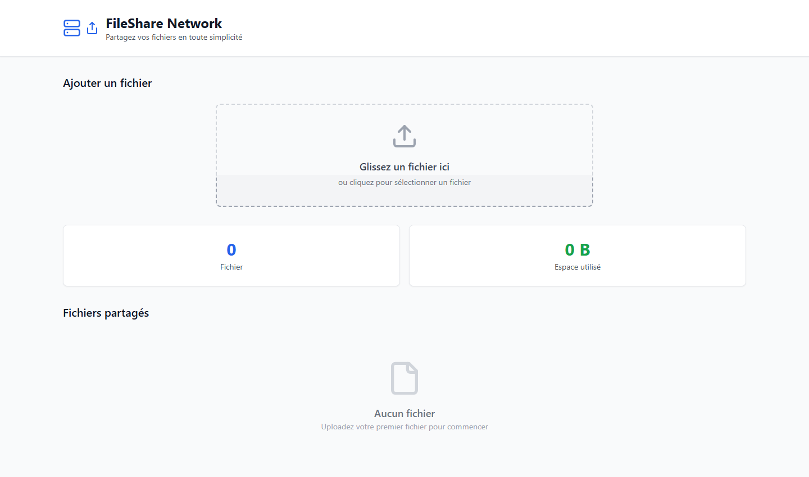
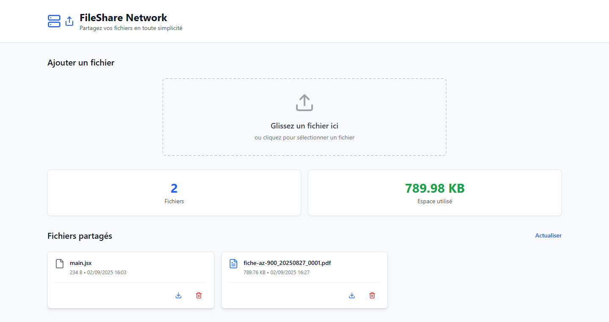

````markdown
# 📂 FileShare Network

FileShare Network permet de **partager facilement des fichiers** entre plusieurs machines connectées au même réseau local.  
Construit avec **React (Vite)**, **Express**, **TailwindCSS** et **Multer**, il offre une interface moderne et une API backend robuste.

---

## ✨ Fonctionnalités

- 📤 Upload de fichiers depuis l’interface web  
- 📂 Liste et gestion des fichiers disponibles sur le serveur  
- 📥 Téléchargement des fichiers partagés  
- 🗑️ Suppression des fichiers inutiles  
- 🌐 Accessible depuis n’importe quel appareil du même réseau  
- ⚡ Interface moderne et responsive (React + TailwindCSS)  

---

## 🛠️ Stack technique

- **Frontend** : [React](https://react.dev/) + [Vite](https://vitejs.dev/) + [TailwindCSS](https://tailwindcss.com/)  
- **Backend** : [Express.js](https://expressjs.com/) + [Multer](https://github.com/expressjs/multer)  
- **Outils** : [Concurrently](https://www.npmjs.com/package/concurrently) pour lancer client + serveur  

---

## 🚀 Installation

Clone le projet :

```bash
git clone https://github.com/ARROKO/FileShare-Network.git
cd FileShare-Network
````

Installe les dépendances :

```bash
npm install
```

Lance l’application en mode développement (client + serveur) :

```bash
npm run dev
```

* Frontend : [http://localhost:5173](http://localhost:5173)
* Backend API : [http://localhost:4001](http://localhost:4001)

---

## 📦 Build

Pour builder la partie frontend :

```bash
npm run build
```

Puis prévisualiser :

```bash
npm run preview
```

---

## 📡 API Backend

Toutes les routes commencent par :

```
http://<IP_MACHINE>:4001/api
```

### 🔹 Liste des fichiers

```http
GET /api/files
```

### 🔹 Upload

```http
POST /api/upload
```

Body (form-data) :

```
file=<votre fichier>
```

### 🔹 Télécharger

```http
GET /api/download/:filename
```

### 🔹 Supprimer

```http
DELETE /api/files/:filename
```

---

## 📸 Aperçu

### 🔹 Page d’accueil



### 🔹 Upload de fichiers & Liste des fichiers partagés



---

## 🤝 Contribution

Les contributions sont les bienvenues !
Forkez le repo, créez une branche, et proposez une Pull Request 🚀

---

## 📜 Licence

Ce projet est sous licence **MIT**.
Tu es libre de l’utiliser, le modifier et le distribuer.

---

💡 **FileShare Network** : le moyen le plus simple de partager des fichiers sur ton réseau local.
